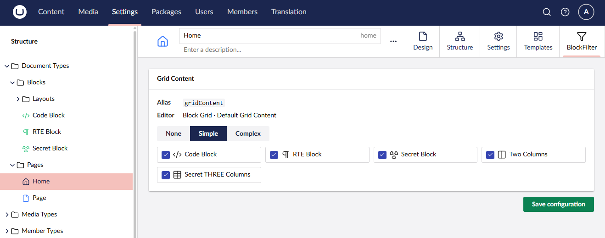

# Block Filter (by Kraftvaerk)

By default, Umbraco's Block Catalogue shows every configured block to every editor, every time. Block Filter gives you control over that.

It replaces the Block Catalogue Modal with one it controls, and fires a `RemodelBlockCatalogueNotification` each time it opens. Register a handler for that notification and you can filter the available blocks based on anything you have access to at runtime: the current user's groups, the document type being edited, which property editor is open, or anything else.

Requires Umbraco 16.0 or later.

---

## Installation

```bash
dotnet add package Kraftvaerk.Umbraco.BlockFilter
```

---

## Usage

Register a handler in a composer and mutate `notification.Model.Blocks` however you need:

```csharp
public class YourNotificationHandler : INotificationAsyncHandler<RemodelBlockCatalogueNotification>
{
    public async Task HandleAsync(RemodelBlockCatalogueNotification notification, CancellationToken cancellationToken)
    {
        // Hide "mySecretBlock" from everyone who isn't an admin
        var adminOnly = new List<string> { "mySecretBlock" };

        if (!notification.Model.User.Groups.Any(g => g.Name == "Administrators"))
        {
            notification.Model.Blocks = notification.Model.Blocks
                .Where(b => !adminOnly.Contains(b.Alias))
                .ToList();
        }

        // "codeBlock" is not allowed on the homepage
        if (notification.Model.ContentTypeAlias == "home")
        {
            notification.Model.Blocks = notification.Model.Blocks
                .Where(b => b.Alias != "codeBlock")
                .ToList();
        }
    }
}

public class YourComposer : IComposer
{
    public void Compose(IUmbracoBuilder builder)
    {
        builder.AddNotificationAsyncHandler<RemodelBlockCatalogueNotification, YourNotificationHandler>();
    }
}
```

---

## Built-in configurator UI

If you'd rather not write code for this, Block Filter includes an optional backoffice UI. Enable it and a **BlockFilter** tab appears on every document type workspace, letting editors configure filtering rules per Block List or Block Grid property without touching a `.cs` file.



Three modes are available per property:

- **None** - No filtering. All blocks are shown (default).
- **Simple** - Check the blocks that should be available.
- **Complex** - Define weighted allow/deny rules per block and user group. The rule with the highest weight wins.

Configuration is stored as JSON under `blockfilter/{documentTypeAlias}.json` in your site root, keyed by alias rather than GUID so rules carry across environments without manual adjustment.

### Enabling it

Add to `appsettings.json`:

```json
{
  "BlockFilter": {
    "EnableSettingsTab": true
  }
}
```

This registers the backoffice tab and a built-in notification handler that applies the saved rules on every modal open. Your own custom handlers still run alongside it - the two approaches are not mutually exclusive.

### How complex rules are evaluated

1. Collect all rules where the block alias matches and the rule targets the current user's group (or "Everyone").
2. Pick the rule with the highest weight.
3. Allow or deny based on that rule's type.
4. If no rules match, the block is allowed by default.

### Custom storage path

Config files are written to `{ContentRootPath}/blockfilter/` by default. You can change this if needed, for example when running on a read-only filesystem:

```json
{
  "BlockFilter": {
    "EnableSettingsTab": true,
    "StoragePath": "custom/path"
  }
}
```

---

## License & contributing

MIT licensed and open to contributions. If you find a bug or have an idea, open an issue or submit a pull request.

-- Kaspar
